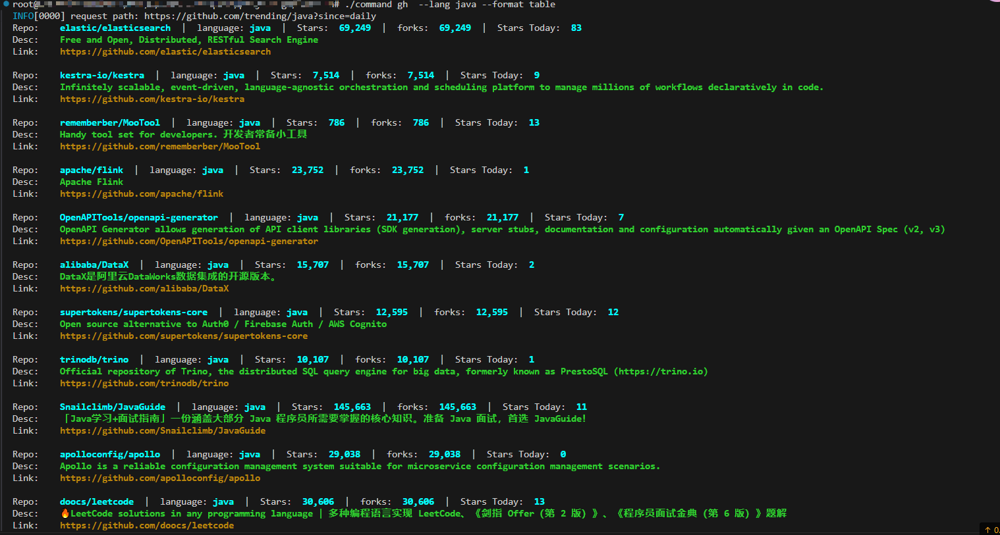

# command

这是基于GO实现的命令行工具, 实现功能如下:

### github trending
这是go 爬虫的一个应用, 用于展示 github上的  trending 数据.
> ./command gh --lang java --format table
>
> ./command gh  # 默认参数为 --lang java  --format table

结果:

